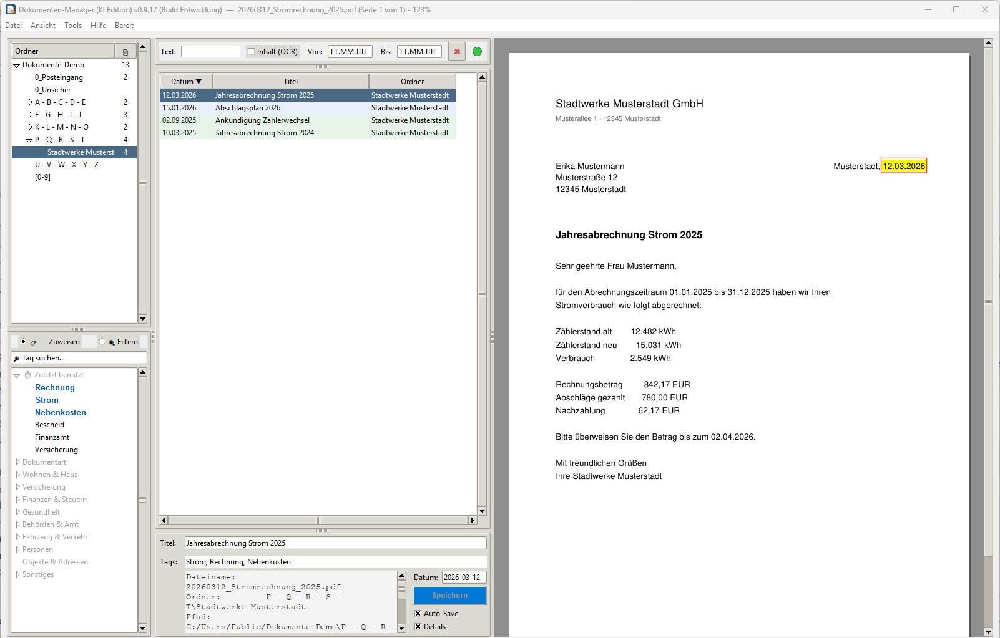

# Dokumenten-Manager (KI Edition)

Ein Programm für Windows, das PDF-Dokumente (Rechnungen, Verträge, Bescheide, Scans) in einer normalen Ordnerstruktur auf dem eigenen Rechner verwaltet: Titel, Tags und Datum vergeben, blitzschnell suchen, Dubletten finden, Dateinamen aufräumen. Eine optionale lokale KI beschriftet neue Scans und legt sie von selbst ab.

**Alles bleibt bei dir.** Titel, Tags und Datum werden direkt in die PDF-Dateien geschrieben (in deren Metadaten, der Inhalt bleibt unverändert). Es gibt keine Datenbank, keinen Online-Dienst, keine Anmeldung. Auch die KI läuft lokal ([Ollama](https://ollama.com)) - auf diesem oder einem anderen Rechner im eigenen Netz.

## Download

Die fertige Windows-Version liegt unter [Releases](https://github.com/peterm2024/Dokumenten-Manager/releases): `DokumentenManager.exe` in einen eigenen Ordner legen und starten, keine Installation nötig. Windows SmartScreen fragt beim ersten Start nach („Weitere Informationen" → „Trotzdem ausführen"), weil die Datei nicht signiert ist.

Neue Versionen meldet das Programm beim Start von selbst (Hilfe → „Auf neue Version prüfen…"). Zum Aktualisieren die neue EXE einfach über die alte kopieren; die Einstellungen bleiben erhalten.

## Beta-Test

Das Programm ist in der Beta-Phase. Wer mittestet, findet in [BETA_LEITFADEN.md](BETA_LEITFADEN.md) alles Nötige auf einer Seite: Einrichtung, KI mit oder ohne, was getestet werden soll, bekannte Grenzen und wie Rückmeldungen am meisten helfen. Rückmeldungen bitte als [Issue](https://github.com/peterm2024/Dokumenten-Manager/issues).

## Was das Programm kann

- **Ordner und Dokumente:** Ordnerbaum links, Dokumentenliste in der Mitte, Seitenvorschau rechts. Dateien per Maus verschieben, umbenennen, löschen (Papierkorb der Sammlung). Neue Dateien im Ordner werden von selbst bemerkt.
- **Beschriften:** Titel, Tags und Datum je Dokument; Tag-Katalog mit Ober- und Unterbegriffen; Auto-Save.
- **Suchen:** Text, Tags, Datum („2021" oder „07.2021" reicht), auf Wunsch auch im Inhalt gescannter Seiten (OCR). Treffer werden in der Vorschau markiert.
- **Aufräumen:** Dubletten finden (doppelt gescannt oder kopiert), Dateinamen vereinheitlichen, PDF-Inspektor.
- **KI (optional):** Titel vorschlagen, Tags ergänzen, Ablage-Vorschau, und eine Vollautomatik, die neue Scans aus dem Posteingang beschriftet und einsortiert - gedacht für Angehörige, die nur noch den Scanner bedienen.

## KI: Was man braucht

Für die KI-Funktionen läuft [Ollama](https://ollama.com) mit dem Bild-Modell `qwen2.5vl:7b` - auf diesem PC oder auf einem Rechner im Heimnetz. Einrichtung in drei Schritten steht im Programm unter Hilfe → „KI auf dem eigenen PC". Steht der Server woanders, etwa bei Angehörigen, verbindet [Tailscale](https://tailscale.com) beide Rechner privat und verschlüsselt, ohne Portfreigabe am Router - im Programm erklärt unter Hilfe → „KI-Server aus der Ferne (Tailscale)". Richtwerte, wie lange ein Dokument dauert:

| Rechner | Dauer je Dokument | Bemerkung |
|---|---|---|
| nur Prozessor (ohne Grafikkarte) | 2 bis 10 Minuten | mind. 16 GB Arbeitsspeicher; in den Einstellungen „KI ohne Grafikkarte zulassen" ankreuzen |
| Grafik im Prozessor (integriert) | wie nur Prozessor | Ollama nutzt integrierte Grafik unter Windows in der Regel nicht |
| eigene Grafikkarte mit 8 GB | 20 bis 60 Sekunden | Modell passt gerade |
| eigene Grafikkarte mit 16 GB | 5 bis 20 Sekunden | alles im Grafikspeicher - der gedachte Normalfall |

Ohne KI ist das Programm vollständig nutzbar; die KI-Einträge im Menü sind dann ausgegraut.

## Änderungen

Die Kurzfassung je Version steht in [CHANGELOG.md](CHANGELOG.md), die ausführlichen Texte bei den jeweiligen Releases.

## Lizenz

GNU Affero General Public License v3.0, siehe [LICENSE](LICENSE). Der Quellcode wird in einem eigenen Schritt veröffentlicht; bis dahin ist er auf Anfrage erhältlich.
